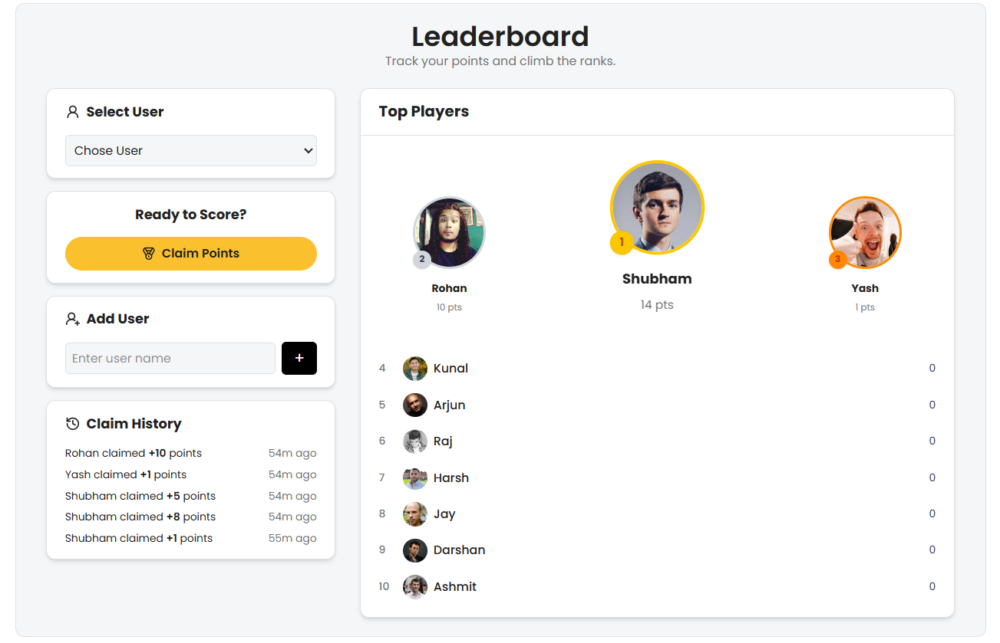

# Leaderboard App

This is a full-stack leaderboard application built using ReactJS for the frontend, Node.js with Express for the backend, and MongoDB for data storage. It allows you to add users, claim random points, and view a real-time leaderboard along with a claim history.

**Live Link:** [https://leaderboard-web.vercel.app/](https://leaderboard-web.vercel.app/)

## Screenshot



## Features

- Select and add users
- Claim random points (1–10) for any user
- View real-time leaderboard sorted by total points
- View claim history with timestamps

## Technologies Used

- Frontend: ReactJS, Axios, Tailwind CSS 4.1
- Backend: Node.js, Express
- Database: MongoDB with Mongoose

## Setup Instructions

### 1. Clone the Repository

```bash
git clone https://github.com/Shubham-567/leaderboard-project.git
cd leaderboard-app
```

### 2. Setup Backend

```bash
cd backend
npm install
```

Create a .env file inside the backend folder:

```bash
PORT=5000
MONGO_URI=your_mongodb_connection_string/leaderboard

```

Start the backend server:

```bash
npm run dev
```

### 3. Setup Frontend

```bash
cd frontend
npm install
npm run dev
```

Make sure the backend is running on http://localhost:5000 and frontend on http://localhost:5173 (or as configured).

## API Endpoints

### Backend API Server

- `GET /users` - Retrieve all users
- `POST /users` - Create a new user
- `GET /leaderboard` - Get leaderboard (sorted by total points)
- `POST /claim/:id` - Claim random points for a user
- `GET /claim/history` - Get claim history for all users

## Project Structure

The project is organized into two parts:

- `backend/`: Node.js server with API routes, MongoDB models, and controllers
- `frontend/`: ReactJS app with components for claiming points, leaderboard, user selection, and history

## Notes

- All point claims are stored in a `ClaimHistory` collection
- Leaderboard updates dynamically after every claim
- The UI is designed to be clean, simple, and responsive

## License

This project is licensed under the MIT License.
